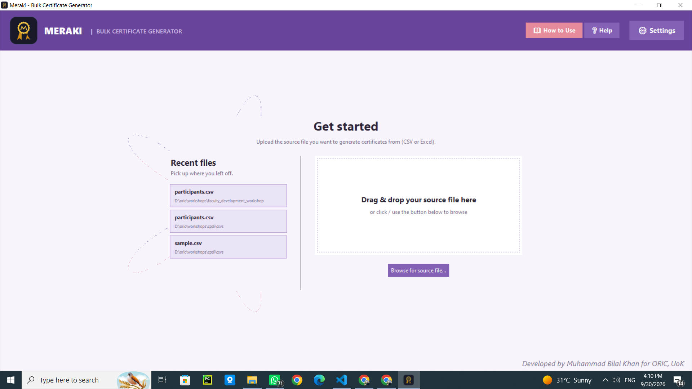
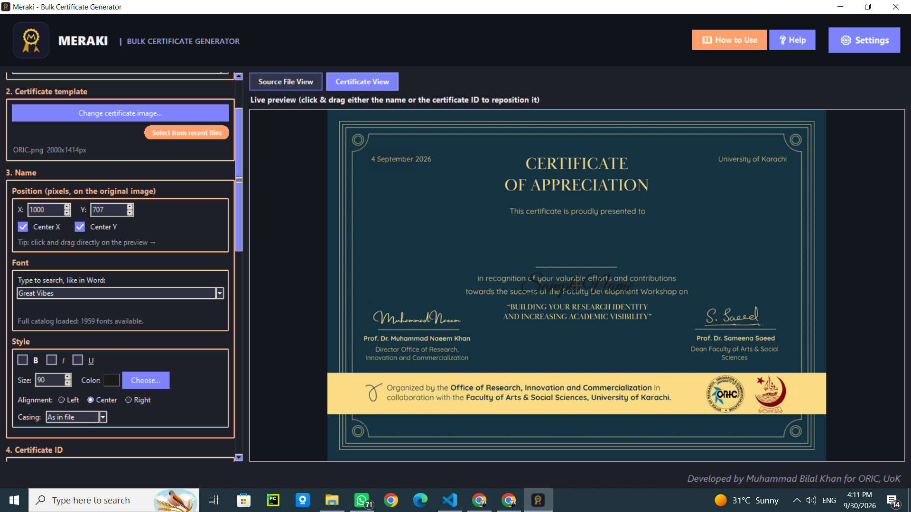
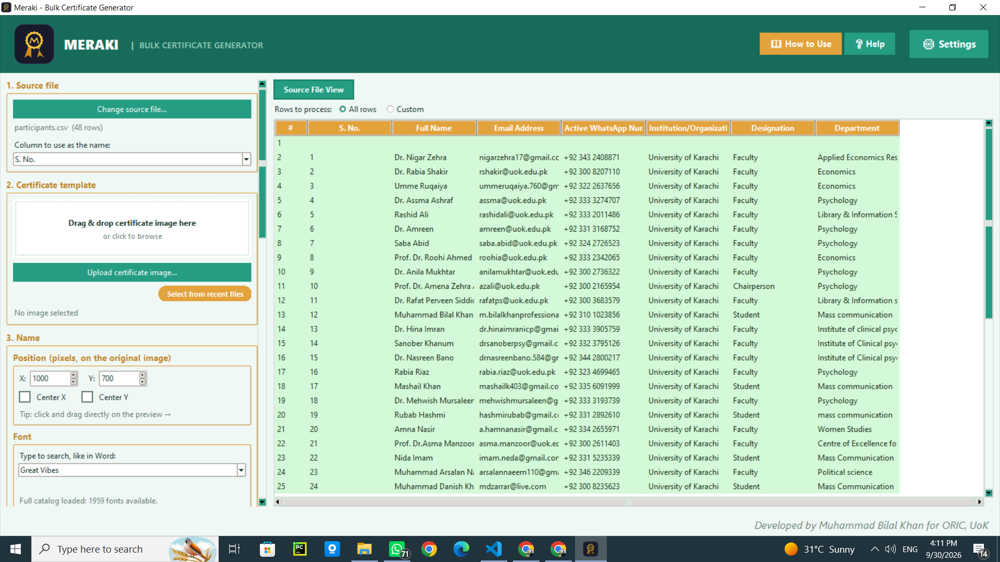
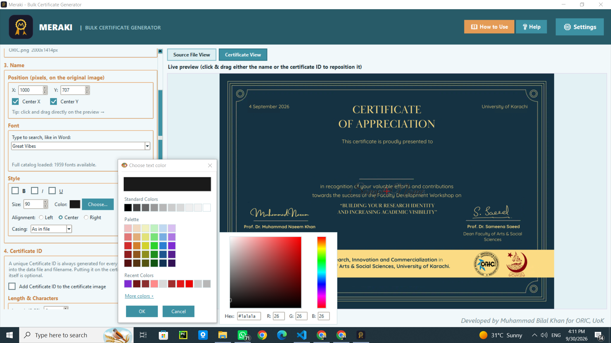

<div align="center">

# Meraki

### Bulk Certificate Generator

Turn a spreadsheet of names and one certificate template into a full batch of personalized PDFs, PNGs, or JPGs.


Built for the **Office of Research, Innovation & Commercialization (ORIC)**, University of Karachi.

</div>

---

## 📑 Table of Contents

- [Overview](#-overview)
- [Features](#-features)
- [Screenshots](#-screenshots)
- [Getting Started](#-getting-started)
- [How to Use Meraki](#-how-to-use-meraki)
- [Working with Rows](#-working-with-rows)
- [Certificate IDs](#-certificate-ids)
- [Fonts and Text Styling](#-fonts-and-text-styling)
- [Themes](#-themes)
- [How Positioning Works](#-how-positioning-works)
- [Output Files](#-output-files)
- [Settings and Data Storage](#-settings-and-data-storage)
- [Building the Executable](#-building-the-executable)
- [Project Structure](#-project-structure)
- [Architecture Notes](#-architecture-notes)
- [Troubleshooting](#-troubleshooting)
- [Support](#-support)
- [Credits](#-credits)

---

## 🎯 Overview

Meraki is a Windows desktop app for producing certificates in bulk. It works in the same spirit as Canva's "Bulk Create": you load a list of people, load a certificate design, drag the name to where it belongs, and let the app produce one file per person.

It started as a single Tkinter script and has since been rebuilt with a new interface, a modular codebase, and a much larger theming system. The workflow is the same as before, but almost everything around it is new: a proper upload screen, an Excel-style grid, row selection tools, automatic Certificate IDs, a custom color picker, and drag-and-drop everywhere it makes sense.

## ✨ Features

**Loading your data**
- Read `.csv`, `.xlsx`, and `.xlsm` files, one row per person.
- A dedicated **Upload Source File** screen with recent files on one side and a drag-and-drop zone on the other.
- Native drag-and-drop on the upload screen, the Certificate View tab, and the Source File View tab. Dropping a new file replaces the one currently loaded.
- Recent files are remembered (up to 8 each) for both source files and certificate images.

**Designing the certificate**
- Drag the name directly on a live preview, or type exact pixel coordinates.
- Every person gets a unique **Certificate ID**, generated automatically. It is always saved to your source file and added to the output file name. Printing it on the certificate is optional, and it can be positioned and styled like the name.
- Pick the font, size, color, alignment, and Bold, Italic, or Underline styling.
- Choose a casing rule: as in file, UPPERCASE, lowercase, Title Case, Sentence case, or tOGGLE cASE. Casing is applied only when rendering, so your source data is never modified.
- Word-style font autocomplete with live filtering.
- An advanced color picker with a standard color grid, a shaded palette, recent colors, and an HSV spectrum with hex and RGB entry.

**Choosing who gets a certificate**
- An Excel-like grid of your source file with green and red row highlighting.
- Process all rows, a typed range, or rows picked directly in the grid.
- Shift-click and Ctrl-click selection, plus lockable range chips so you can build up several separate ranges without one click undoing another.

**Generating**
- Export as PDF, PNG, or JPG.
- Files are named after each person, followed by their Certificate ID, for example `Muhammad_Bilal_Khan_s3W4B8.pdf`.
- The progress bar appears only while a run is active.

**Polish**
- Twelve built-in themes, from soft light palettes to two dark ones.
- Animated splash screen, a first-run API key prompt, and an in-app **How to Use** guide.
- Exit confirmation, and a modal-dialog attention system (flash, shake, and sound) so a blocked main window never looks frozen.

## 📸 Screenshots

<!--
Replace these placeholders with real screenshots and keep the file names,
or update the paths below. A docs/screenshots folder works well.
-->

| Upload screen | Certificate View |
|:---:|:---:|
|  |  |

| Source File View | Color picker |
|:---:|:---:|
|  |  |

## 🚀 Getting Started

### 📋 Requirements

- Windows, with Python 3.9 or newer. The app relies on a few Windows-specific behaviors, such as taskbar icon handling and the settings folder location.
- The packages listed in `requirements.txt`:

| Package | What it does |
|---|---|
| **Pillow** | Loads images, renders styled text onto certificates, and exports PDF, PNG, and JPG |
| **openpyxl** | Reads and writes `.xlsx` and `.xlsm` files. CSV needs nothing extra |
| **tkinterdnd2** | Provides drag-and-drop. Optional at runtime |

`tkinter` is not installed through pip. It comes with the standard python.org Windows installer.

If `tkinterdnd2` is missing, Meraki still runs. It simply falls back to the Browse buttons instead of drag-and-drop.

### ⬇️ Install

```bash
git clone https://github.com/mbilalkhan704/bulk-certificates-generator-ORIC-UOK.git
cd bulk-certificates-generator-ORIC-UOK
pip install -r requirements.txt
```

### ▶️ Run

```bash
python mck_app.py
```

`mck_app.py` is the entry point. Run that file, not any of the other `mck_*.py` modules on their own.

## 📖 How to Use Meraki

The app also has a full walkthrough built in. Open **How to Use** from the top toolbar at any time. The short version:

1. **Load a source file.** Drop a CSV or Excel file on the upload screen, or click Browse, or pick one from your recent files. Each row should be one person.
2. **Load a certificate template.** Use the Certificate View tab, drop an image onto it, or use the "Select from recent files" pill in the left panel.
3. **Choose the name column.** Tell Meraki which column holds the names.
4. **Place the name.** Drag it on the preview until it sits where you want, or type exact X and Y values.
5. **Style it.** Set the font, size, color, alignment, styling, and casing. The preview updates as you change things.
6. **Set up Certificate IDs.** Choose how long the ID should be and which characters it can use. To print it on the certificate, tick **Add Certificate ID to certificate**, then position and style it the same way as the name.
7. **Pick your rows.** Use the Source File View tab to select everyone, a range, or a hand-picked set.
8. **Generate.** Choose PDF, PNG, or JPG, pick the output folder, and start the run.

The Certificate View and Source File View tabs only appear once the data behind them exists, so you will not see an empty tab before you have loaded anything.

## 🗂️ Working with Rows

The Source File View tab shows your data in a grid, and it controls exactly which rows are processed.

| Mode | How it works |
|---|---|
| **All rows** | Every row in the file gets a certificate. |
| **Custom ranges** | Type a range such as `1-25`, or select rows directly in the grid. |
| **Shift-click** | Select a continuous block of rows. |
| **Ctrl-click** | Add or remove single rows from the selection. |
| **Range chips** | Lock a range in place as a chip. You can then build a second or third range without the new clicks undoing the earlier ones. |

Green and red row highlighting in the grid shows which rows are part of the run, so you can check the selection before you generate anything.

## 🔖 Certificate IDs

Every certificate Meraki produces has a Certificate ID. IDs are generated by default, so you do not have to turn anything on for them to exist. They are always written to your source file and always added to the output file name. The only optional part is whether the ID is also printed on the certificate itself.

### Configuring the ID

Everything is set from the left panel:

| Setting | Options |
|---|---|
| **Length** | Any length from 6 characters upward. 6 is the minimum. |
| **Characters** | Uppercase letters, lowercase letters, digits, or any combination of these. |
| **Add Certificate ID to certificate** | A checkbox. Ticking it draws the ID on the certificate image. Leaving it unticked still saves the ID and uses it in the file name. |

An ID looks something like `s3W4B8`.

### Printing the ID on the certificate

When **Add Certificate ID to certificate** is ticked, the ID becomes a second text element that you control the same way as the name. It has its own font, size, color, alignment, and styling, and you can drag it anywhere on the preview or type exact coordinates. It does not have to sit near the name.

### Saving IDs to your source file

IDs are stored in the **last column** of the CSV or Excel file you loaded. Meraki only fills in the rows that do not already have one:

- A row that already has an ID is left untouched.
- A row with an empty ID cell gets a new one.

This means you can run the same file in several batches, add new people to the bottom, and re-run it later. Nobody's existing ID changes.

Because this writes to your file, keep a copy of the original if you need one.

## 🔤 Fonts and Text Styling

### 🔠 Font picker

The Name and Certificate ID each have their own font box. It works like the font box in a word processor: start typing and the list filters live. Click the box once to select all of its text, click again to edit. Scrolling the mouse wheel over the box scrolls the left panel instead of cycling through fonts, so you will not change your font by accident.

### 🔑 Google Fonts and the API key

Meraki can pull fonts from Google Fonts, and it ships with a bundled default so it works offline. Every install starts with only that default font available. To unlock the full library:

1. Get a free Google Fonts API key from Google.
2. Enter it in the first-run prompt, or later through **Settings** (the gear icon).
3. Meraki checks the key with Google before saving it. A key that Google rejects is not saved.

There is no key bundled with the app, so each person or machine needs its own. If you skip the prompt, you can add a key at any time.

### 🅱️ Bold, Italic, and Underline

These work with any font, including fonts that have no bold or italic file of their own. Bold is simulated with a text outline, italic with a slant transform, and underline with a drawn line. They can be combined.

### 🔡 Casing

| Option | Example result for "muhammad bilal khan" |
|---|---|
| As in file | muhammad bilal khan |
| UPPERCASE | MUHAMMAD BILAL KHAN |
| lowercase | muhammad bilal khan |
| Title Case | Muhammad Bilal Khan |
| Sentence case | Muhammad bilal khan |
| tOGGLE cASE | mUHAMMAD bILAL kHAN |

Casing is applied at render time only. Your spreadsheet is left exactly as it was.

### 🖌️ Color picker

The color picker opens with a grid of standard colors, a shaded palette, and your recently used colors. **More colors** opens an HSV spectrum with hex and RGB entry. Recent colors are saved between sessions.

## 🎨 Themes

Meraki ships with twelve themes, and you can switch between them from Settings. Each one has its own palette, and dialogs follow the active theme so nothing looks out of place when a window opens.

| Theme | Feel | Main accent |
|---|---|---|
| **Light** | Clean indigo on white | Indigo, with a coral secondary |
| **Dark** | Charcoal with soft violet | Periwinkle |
| **Midnight** | Deep navy | Bright blue |
| **Ocean** | Fresh teal and aqua | Teal, with an amber secondary |
| **Arctic** | Cool, muted blue-green | Glacier blue |
| **Sunset** | Warm terracotta | Coral |
| **Forest** | Calm woodland green | Pine green |
| **Emerald** | Brighter, jewel-toned green | Emerald |
| **Lavender** | Soft purple with a rosy secondary | Lilac |
| **Amethyst** | Deeper, richer purple | Amethyst |
| **Rose** | Dusty pink | Rose |
| **Coffee** | Warm browns on cream | Espresso brown |

Light, Ocean, Arctic, Sunset, Forest, Emerald, Lavender, Amethyst, Rose, and Coffee are light themes. Dark and Midnight are the two dark ones, with their own row and text colors tuned for readability.

The splash screen keeps a fixed dark background regardless of theme, since it is branding rather than app interface.

### ➕ Adding your own theme

Themes live in `mck_themes.py` as a single `THEMES` dictionary. To add one, copy an existing entry and give it a new name. Every theme defines the same set of keys:

| Group | Keys |
|---|---|
| Surfaces | `bg`, `panel_bg`, `canvas_bg`, `entry_bg`, `dialog_bg` |
| Toolbar | `toolbar_bg`, `toolbar_fg`, `toolbar_sub` |
| Accents | `accent`, `accent_active`, `accent2`, `accent2_active` |
| Tabs | `tab_inactive_bg`, `tab_border` |
| Text and borders | `text`, `subtle_text`, `border` |
| Validation | `invalid_bg`, `invalid_border` |

Leave none of them out. If a key is missing, parts of the interface will have nothing to draw with.

## 📐 How Positioning Works

- X and Y are pixel coordinates on the **original, full-resolution** certificate image, not on the shrunken preview. Meraki converts between the two automatically, so a spot you choose by dragging on the preview lands in the same place in the final file.
- Vertical placement is centered on the Y value you set.
- Horizontal alignment (left, center, or right) is set with the alignment controls, which is the usual way name-plate certificates are laid out.
- Any image size works. The app was tuned for certificates around 2000 x 1414 px, and it will warn you if the proportions look unusual.

## 📦 Output Files

Certificates are saved as PDF, PNG, or JPG, one file per selected row. Each file name is the person's name in Title Case with words joined by underscores, followed by their Certificate ID:

```
<Name_In_Title_Case>_<certificate_id>.<pdf | png | jpg>
```

| Name in the file | Certificate ID | Output file name |
|---|---|---|
| `muhammad bilal khan` | `s3W4B8` | `Muhammad_Bilal_Khan_s3W4B8.pdf` |
| `bilal` | `k9Q2ZP` | `Bilal_k9Q2ZP.png` |

Because every file name ends with a unique ID, two people with the same name never overwrite each other.

The ID is in the file name every time, whether or not you chose to print it on the certificate. What appears on the certificate image itself is only what you set up: the name, the ID if you ticked the checkbox, and your template's own design.

## ⚙️ Settings and Data Storage

Settings live here:

```
%LOCALAPPDATA%\Meraki\settings.json
```

This file holds your theme, your Google Fonts API key, and your recent files, images, and colors. It is a per-user folder, so it works no matter where the app itself is installed. If you used an earlier version, note that the folder was previously named `ORICCertificateGenerator`.

Apart from that file, Meraki writes only to the output folder you choose and, for Certificate IDs, back into your source file.

## 🛠️ Building the Executable

Meraki is packaged with PyInstaller, pointed at `mck_app.py`. This is the command for the Windows command prompt (`^` continues a line):

```bash
pyinstaller --onefile --windowed --icon=icons/app_icon.ico ^
    --add-data "icons;icons" --add-data "fonts;fonts" ^
    --collect-data tkinterdnd2 ^
    mck_app.py
```

| Flag | Purpose |
|---|---|
| `--onefile` | Produces a single `.exe` you can hand to someone else |
| `--windowed` | Stops a console window from opening next to the app |
| `--icon` | Sets the app and taskbar icon |
| `--add-data "icons;icons"` | Bundles the icons folder |
| `--add-data "fonts;fonts"` | Bundles the offline default font |
| `--collect-data tkinterdnd2` | Bundles the drag-and-drop Tcl extension |

> [!IMPORTANT]
> Do not drop `--collect-data tkinterdnd2`. That package ships a small Tcl extension as data files, not just code. Without the flag, drag-and-drop can quietly stop working in the packaged `.exe` even though it worked fine under plain `python`.

The finished executable appears in `dist/`. The person running it does not need Python, Pillow, or any fonts installed.

## 🧩 Project Structure

Meraki is split into focused modules grouped by feature, each kept under roughly 600 lines. This replaced a single script of about 4,500 lines.

```
.
├── mck_app.py              Entry point, assembles the app
├── mck_constants.py        Paths, settings location, palette data
├── mck_themes.py           The THEMES dictionary (all twelve color themes)
├── mck_utils.py            Helpers: fonts networking, CSV/Excel I/O, text rendering, color math
├── mck_dnd.py              Drag-and-drop setup and the app's base class
├── mck_core.py             Init, splash screen, settings, recents, exit confirmation, dialog attention
├── mck_font_picker.py      Word-style font autocomplete (Name and Certificate ID)
├── mck_dialogs.py          Dialog icons, Settings, first-run API key prompt, theme application
├── mck_build_ui.py         Main window: toolbar, left panel, tabs
├── mck_upload_screen.py    Upload Source File screen and tab switching
├── mck_source_view.py      CSV/Excel grid and row selection
├── mck_widgets_certid.py   Reusable widget builders and Certificate ID logic
├── mck_cert_image.py       Loading source files and certificate images
├── mck_color_picker.py     Advanced color picker dialog
├── mck_generation.py       Live preview canvas and the bulk generation run
├── requirements.txt
├── icons/
└── fonts/
```

## 🏗️ Architecture Notes

Each module holds a mixin class. `mck_app.py` combines them through multiple inheritance into a single `CertificateApp` class, which is the thing that actually runs.

A few things worth knowing before you edit:

- No mixin overrides another mixin's methods, so the order of the mixins does not matter, with one exception.
- `CoreMixin` defines `__init__`, so it **must** come before the Tk base class in the inheritance list. There is a comment in `mck_app.py` explaining this. Please read it before reordering anything.
- If you add a feature, put it in the module that matches its area, or start a new module if it does not fit anywhere. That is how the codebase stays out of monolith territory.

## 🩺 Troubleshooting

**Drag-and-drop does nothing.**
Check that `tkinterdnd2` is installed. If you are running the built `.exe`, confirm it was built with `--collect-data tkinterdnd2`. Browse buttons work either way.

**Only one font shows up in the font list.**
That is the expected state without a Google Fonts API key. Add one in Settings to unlock the full library. If Google rejected your key, Meraki will say so and will not save it.

**A key I just typed was not accepted.**
Meraki validates the key with a live request to Google. Check your internet connection, make sure the key has access to the Google Fonts API, and try again.

**The main window does not respond while a dialog is open.**
That is intentional. Dialogs are modal, so the main window is blocked until you close them. Meraki flashes, shakes, or plays a sound on the dialog to point you back to it.

**Certificates look slightly off from the preview.**
Positions are stored against the full-resolution image, so the output should match the preview. If it does not, check that you loaded the intended template and that the alignment setting is what you expect.

**Settings seem to have reset.**
Settings moved from `ORICCertificateGenerator` to `Meraki` in `%LOCALAPPDATA%`. Values from the old folder are not read automatically, so re-enter your API key if needed.

## 💬 Support

Use the **Help** button in the app to report an issue, and **How to Use** for a walkthrough of every feature.

## 💜 Credits

Developed by **Muhammad Bilal Khan** for ORIC, University of Karachi.